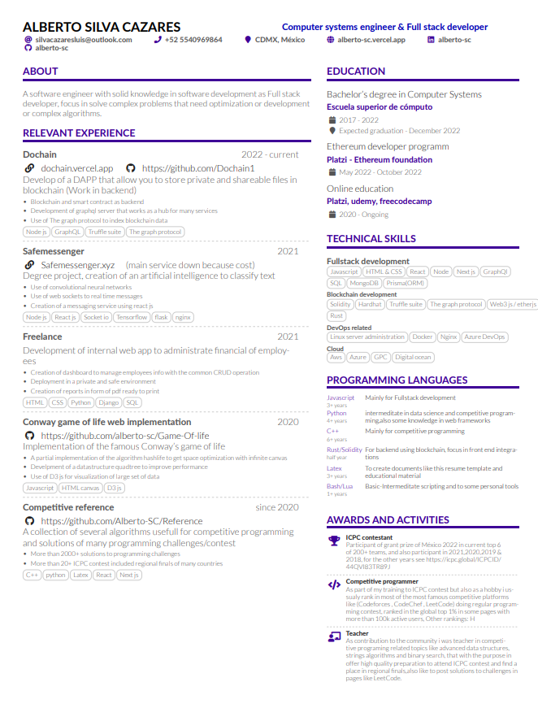
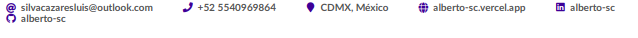
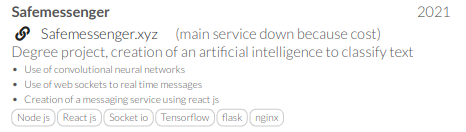

# ReLaTex, yet another LaTeX CV/Resume template
## Description

This package/ template is inspired in https://github.com/liantze/AltaCV,  simplified and extended 

The objective of this template is: 
- Just put your info and compile.
- Minimalist.
- Change general properties easy, colors fonts, space margins, positions. 
- Add common sections with a few pre build commands
## Samples

This is how you resume will look 



## Requirements and Compilation

* xelatex or luaLatex
* fontawesome5, available in the texlive-fonts-extra or from  `fontawesome5`](http://www.ctan.org/pkg/fontawesome5).
* The samples here use the [Lato](http://www.latofonts.com/lato-free-fonts/) 

#### To compile and get the pdf file you have two options 
- Using bash 
  ```bash 
    bash build.sh
  ```
- Using makefile
  ```bash 
    make pdf
  ```

### Structure of the resume and commands/sections

#### General structure
```latex
\cvheader   %Personal info
\columnratio{0.6} % Set the ratio of columns, first column will use 60% of width
\begin{paracol}{2} % Set two columns
\cvsection{Relevant experience} 
\switchcolumn    %Change column
\cvsection{Education}  
\cvsection{Technical skills}
\cvsection{Programming languages}
\cvsection{Awards/activities/certifications}
\end{paracol}
```

Now each section has his own prebuild commands just ready to work and use the less latex code possible. 

##### cvheader 

The command \cvheader is set with three other commands 
```latex
\name{Alberto Silva Cazares}
\tagline{Computer systems engineer \& Full stack developer}
\personalinfo{
  \email{silvacazaresluis@outlook.com}
  \phone{+52 5540969864}
  \location{CDMX, México}
  \homepage{alberto-sc.vercel.app}
  \linkedin{alberto-sc}
  \github{alberto-sc} 
}
```
Name and tagline are autodescriptive, now personalinfo is a set of common ways of contact, there are more prebuild commands: 
-  \email{}  
-  \mailaddress{}
-  \phone{}
-  \homepage{}
-  \twitter{}
-  \linkedin{}
-  \github{}
-  \orcid{}
- \location{}
- \medium{}

All of them are links and some of them accept only the user and behind the link will be completed.

You can add more info with no pre build command with \printinfo

````latex
\printinfo{\faPaw}{Hey}
````

Or define a new fiel with `\NewInfoFiled{fieldname}{symbol}[optional hyperlink prefix]` and use like the mention above. 

````latex
\NewInfoField{gitlab}{\faGitlab}[https://gitlab.com/]
\gitlab{your_id}
````

This personal info will look like:


##### Relevant experience and the *\cvproject* command 
For the section relevant experience exist the command \cvproject that takes 6 parameters in the form: 
`\cvproject{Name}{Date}{Web|media|repo|empty}{Bullet points separated with '|'}{Skills/technologies}`

For the third parameter there is also another useful commands to put specific icons: 
- \website{URL}{Text to show}
- \githublink{URL}
Those commands will put an icon to the left of the link. 
Example in code: 
```latex
\cvproject
{Safemessenger}{2021}
{\website{https://safemessenger.xyz}{Safemessenger.xyz} (main service down because cost)}
{Degree project, creation of an artificial intelligence to classify text }
{Use of convolutional neural networks |
Use of web sockets to real time messages |
Creation of a messaging service using react js}
{Node js,React js,Socket io,Tensorflow,flask,nginx}
\divider
```
You can use a divider to separate each project or not. 
This code will render: 



## Configurable colours

Use `\colorlet` or `\definecolor` to change these.
* `name`
* `tagline`
* `accent`
* `emphasis`
* `body`
* `heading`
* `headingrule`

